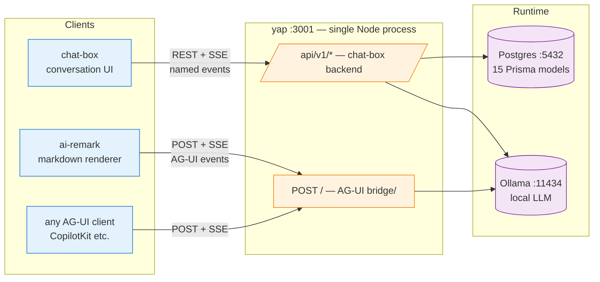
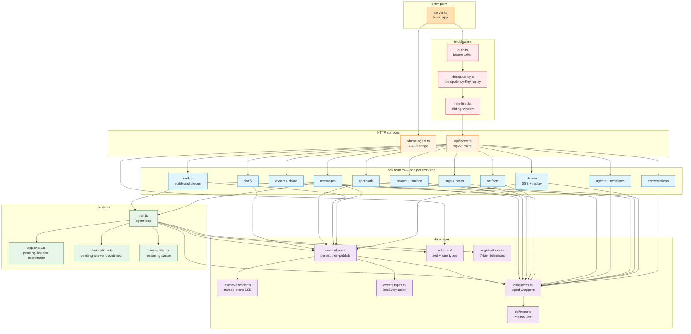
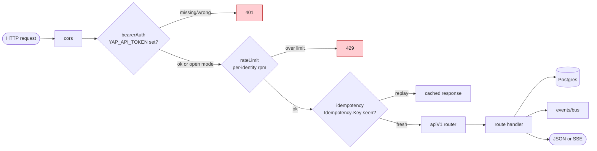
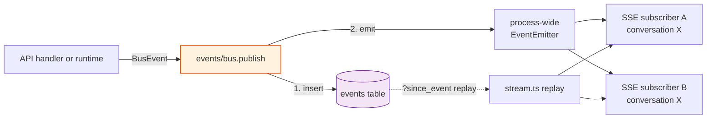
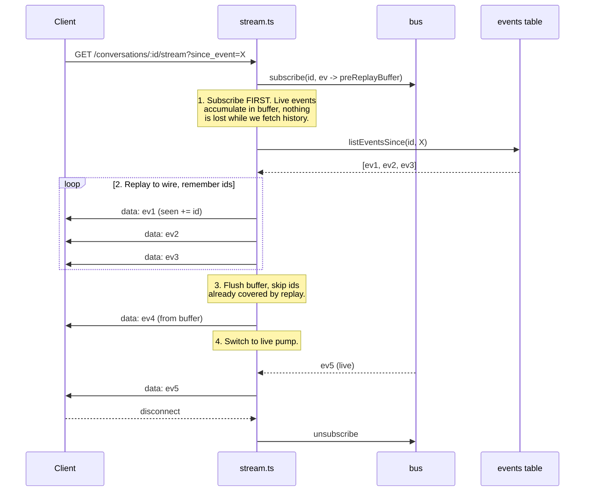
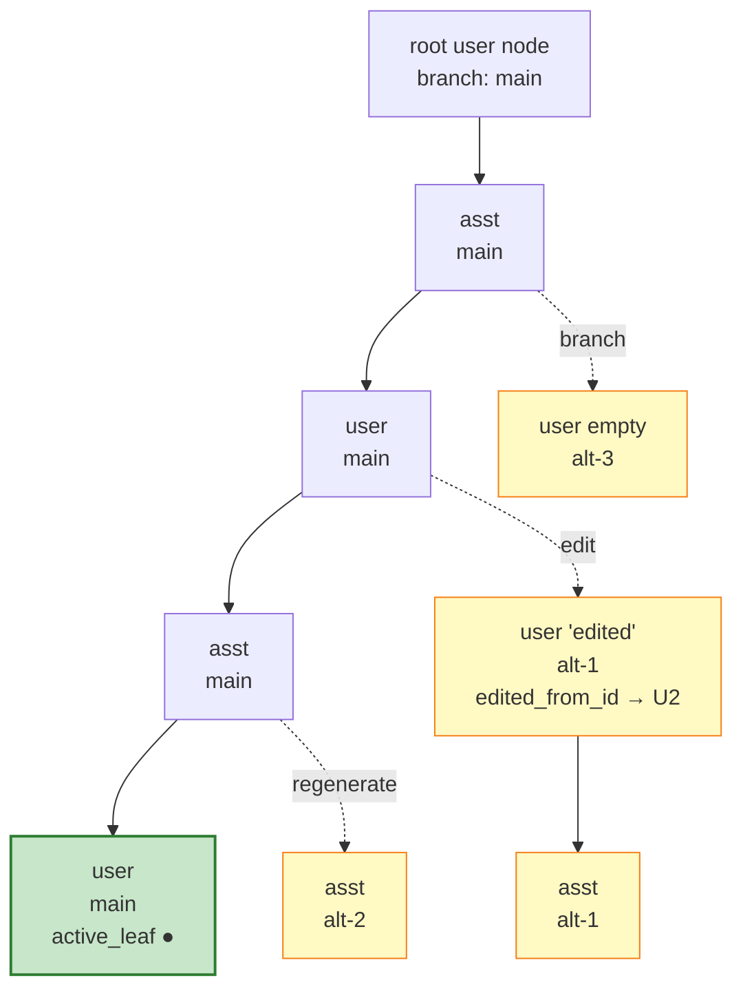
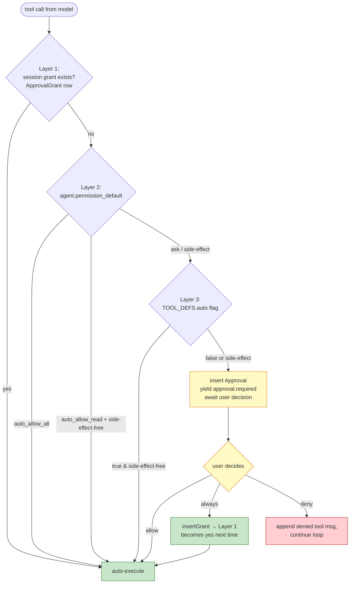
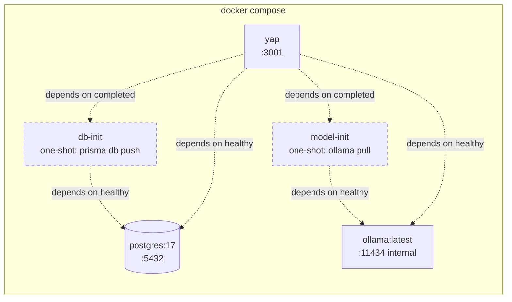

# Architecture

Visual reference for how yap is put together. Pairs with `README.md` (what it does) and `CLAUDE.md` (invariants to preserve when editing).

---

## 1. System context

Two external clients, one server process, two runtime dependencies.



**Why two surfaces on one port.** `POST /` is a thin stateless bridge (no DB, full history per request — the AG-UI contract). `/api/v1/*` is stateful with persisted trees, approvals, artifacts, etc. They share Ollama + config but **never share middleware** — only `/api/v1/*` gets auth/idempotency/rate-limit.

---

## 2. Module layout



---

## 3. Request pipeline for `/api/v1/*`

Every chat-box request flows through the same middleware stack before reaching a router.



`/shared/:token` is the one public exception — it's explicitly skipped by `bearerAuth` so share links work without a token.

---

## 4. Event bus — persist-then-publish

Every state-changing operation produces one or more `BusEvent`s. The bus is the single chokepoint that guarantees the DB is the source of truth for the SSE stream.



**Invariant.** `insertEvent` runs before `emitter.emit`. A subscriber that reconnects with `?since_event=<id>` can replay every event the wire ever saw from the `events` table alone — the in-memory emitter is cache, not source of truth.

---

## 5. Stream race-fix — subscribe-first, replay-after

The `/stream` handler closes a race where events emitted between "replay ends" and "live subscription attaches" would be lost.



Any "simplification" that reverses steps 1 and 2 reintroduces the race.

---

## 6. Runtime agent loop

`runtime/run.ts` drives each assistant turn as an `AsyncGenerator<BusEvent>`. The loop runs up to `MAX_TOOL_ROUNDS` times per turn.

```mermaid
flowchart TB
    START([runAssistantTurn]) --> BUDGET{token budget<br/>exhausted?}
    BUDGET -->|yes| ERR[yield error, return]
    BUDGET -->|no| NODE[insert placeholder<br/>asst node, yield node.created]
    NODE --> ROUND[round = 0]
    ROUND --> STREAM[ollama.chat stream]
    STREAM --> SPLIT[ThinkSplitter<br/>content | reasoning]
    SPLIT --> YIELD[yield content.delta<br/>/ reasoning.delta / status.update]
    YIELD --> CHUNKEND{stream<br/>done?}
    CHUNKEND -->|more chunks| STREAM
    CHUNKEND -->|done| TC{tool calls<br/>in response?}
    TC -->|no| FIN[yield node.finalized]
    FIN --> LEAF[update active_leaf,<br/>yield active_leaf.changed]
    LEAF --> END([done])
    TC -->|yes| PERM{auto approved?<br/>grant / agent perm / auto flag}
    PERM -->|yes| EXEC[executeTool]
    PERM -->|no| APP[insert Approval,<br/>yield approval.required]
    APP --> WAIT[awaitDecision promise]
    WAIT --> DEC{decision}
    DEC -->|deny| DENIED[append 'denied' tool msg]
    DEC -->|allow/always| EXEC
    EXEC --> TRES[append tool result msg]
    TRES --> NEXT{round <<br/>MAX_TOOL_ROUNDS?}
    TRES --> DENIED
    DENIED --> NEXT
    NEXT -->|yes| ROUND
    NEXT -->|no| CAP[yield error<br/>'max tool rounds']
    CAP --> END

    classDef boundary fill:#fff3e0,stroke:#e65100
    classDef decision fill:#e1f5fe,stroke:#0277bd
    classDef io fill:#e8f5e9,stroke:#2e7d32
    class BUDGET,CHUNKEND,TC,PERM,DEC,NEXT decision
    class STREAM,EXEC,APP,WAIT,NODE,FIN,LEAF,YIELD,SPLIT io
```

**Why the coordinator pattern.** `awaitDecision` and `awaitAnswer` are in-process promises. The HTTP handler for `POST /approvals/:id/decide` calls `resolveApproval(id, decision)` which fulfills the runtime's promise and lets the generator continue. This is why yap is single-instance by design — if you need multi-process, the coordinators have to move to a durable store.

---

## 7. Data model — the conversation tree

Each conversation is a DAG of nodes, not a flat list. Edits create siblings on fresh `alt-N` branches; the conversation points at whichever leaf is "active".



Operations in `api/nodes.ts`:

| Op | What it does | Creates |
|---|---|---|
| `POST /nodes/:id/edit` | Edit a user message | New user node sibling on `alt-N`, `edited=true`, `edited_from_id` backref. With `ripple=true`, also kicks off an assistant reply. |
| `POST /nodes/:id/regenerate` | Regenerate an asst reply | New asst node under the same parent user node on fresh `alt-N` branch |
| `POST /nodes/:id/branch` | Fork to new empty user turn | New empty user node sibling on `alt-N`; composer focus, no generation |
| `DELETE /nodes/:id?subtree=true` | Prune a subtree | Irreversible; `fallback_leaf` required if active leaf was inside |
| `GET /nodes/:id/ripple-preview` | Pre-flight an edit | Descendant count, tool-call count, new-approval count |

---

## 8. Three-layer permission model for tools

Checked in `runtime/run.ts#isAutoApproved`, in this precedence:



`isSideEffectful(toolName)` comes from `registry/tools.ts`. `write_file`, `run_tests`, and any tool with mutating intent are side-effectful; `read_file`, `web_search`, `ask_clarification` are not.

---

## 9. Physical deployment (docker compose)



One-shot services (`model-init`, `db-init`) block `yap` from starting until they've succeeded. Both are no-ops on subsequent `compose up`s once their side-effect (pulled model, pushed schema) has already happened.

---

## 10. Shape summary

| Layer | What lives here | Gates |
|---|---|---|
| HTTP | `server.ts` + `api/` routers | CORS, bearer auth, rate limit, idempotency |
| Middleware | `api/middleware/` | Each runs once per `/api/v1/*` request |
| Business | `api/*.ts` handlers | Input validation via `schemas/`, output via `queries.ts` + `bus` |
| Runtime | `runtime/run.ts` | Agent loop, tool dispatch, approvals/clarify coordination |
| Data | `db/queries.ts` | Only place that touches Prisma directly (with one documented exception) |
| Transport | `events/bus.ts` + `events/encoder.ts` | Persist-then-publish; named-event SSE |
| Schemas | `schemas/` | Zod round-trip for every wire type and `BusEvent` variant |
