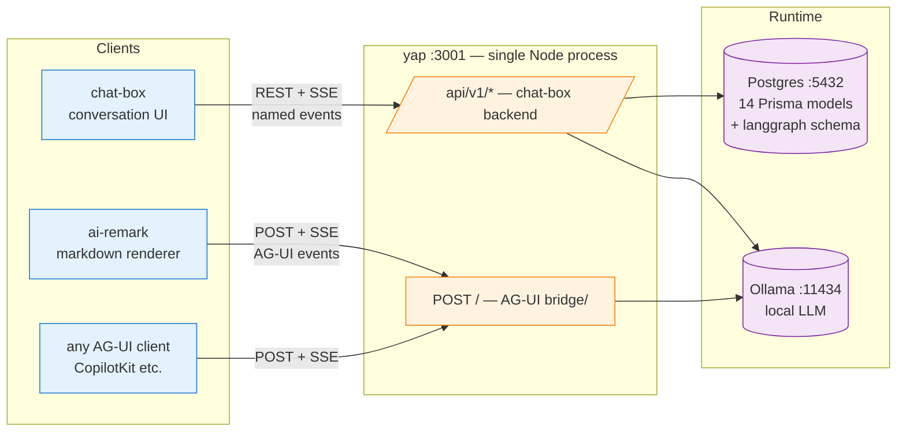
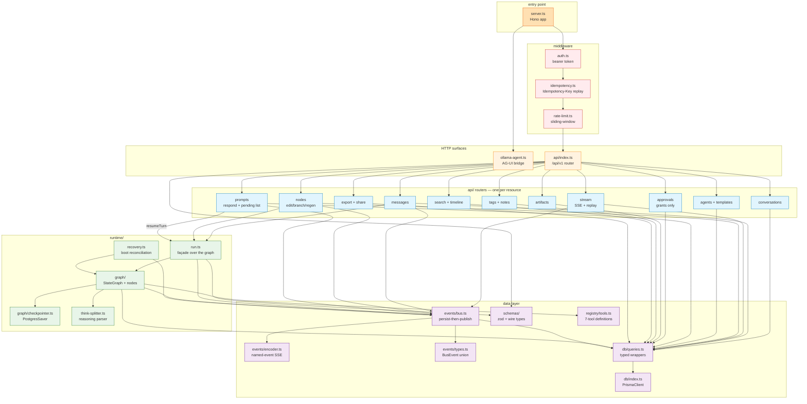
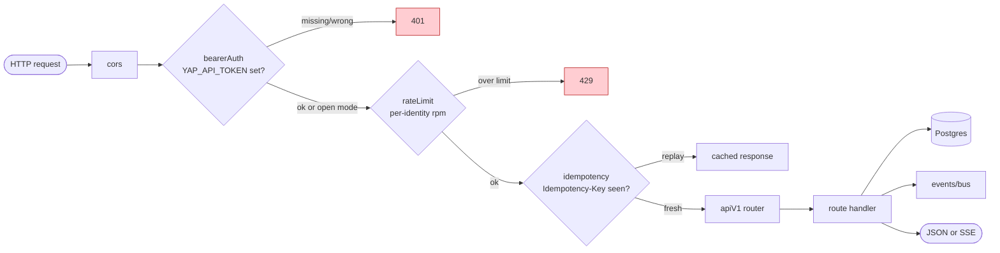
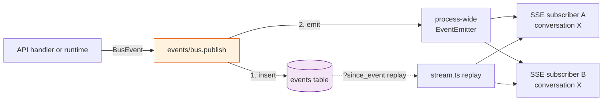
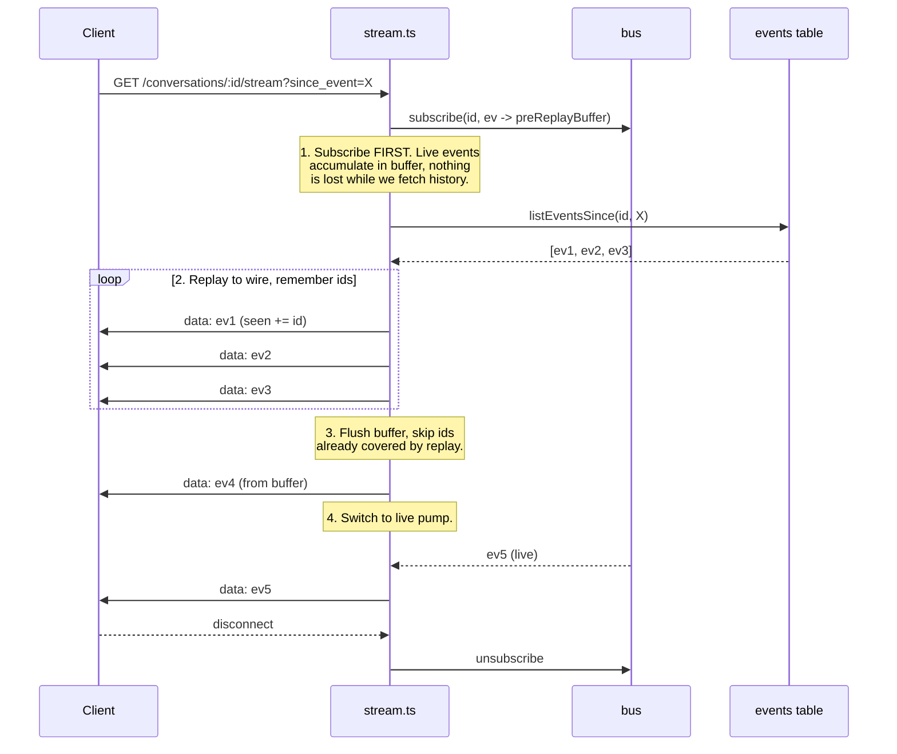
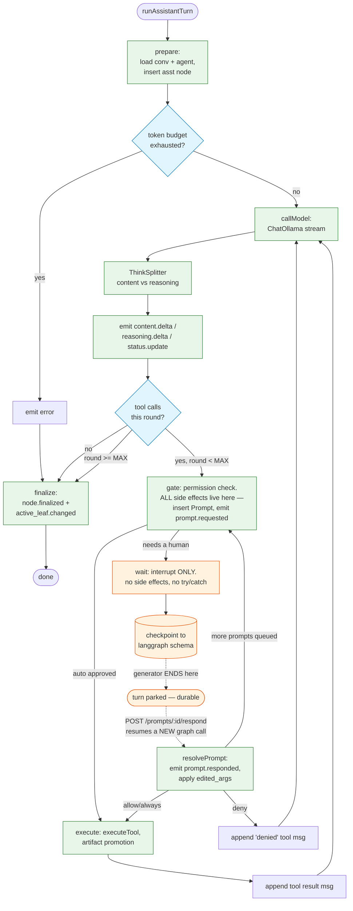
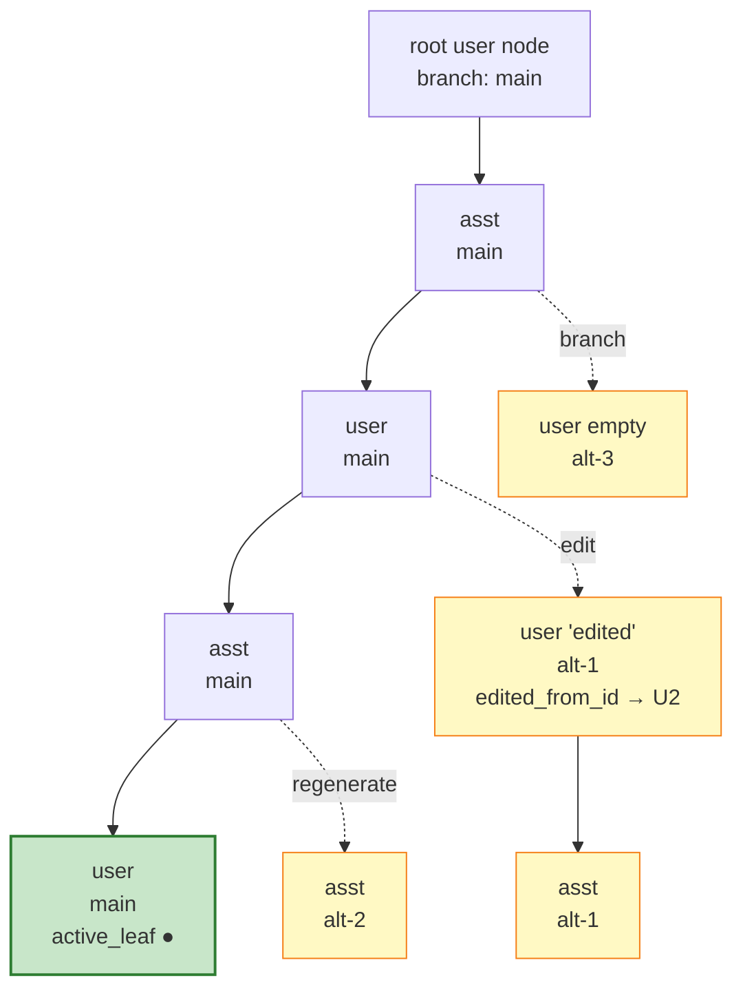
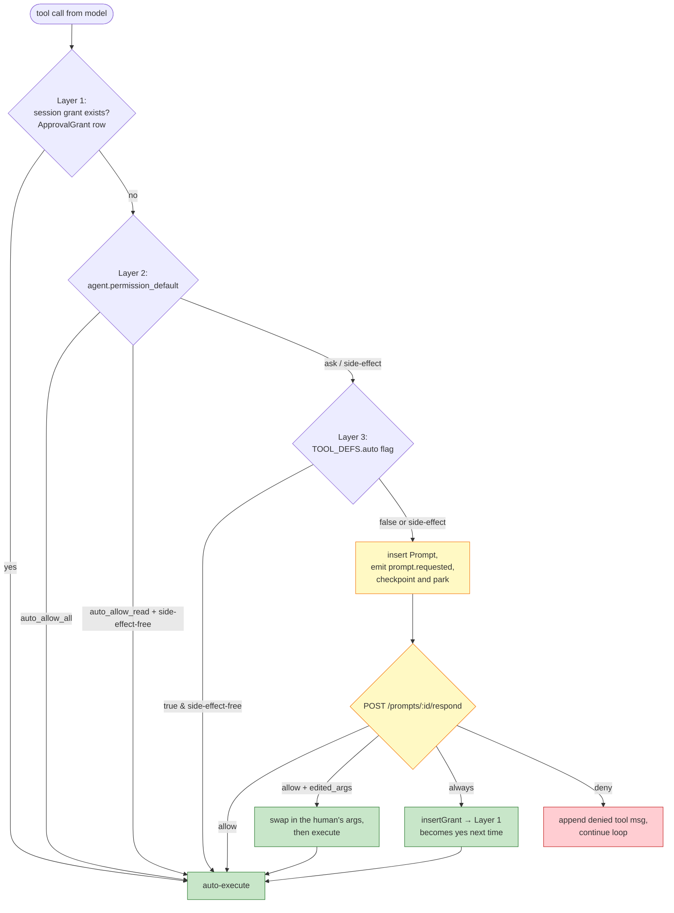
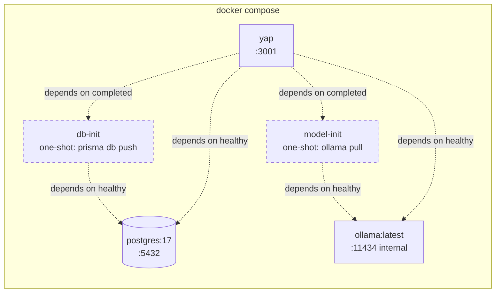

# Architecture

Visual reference for how yap is put together. Pairs with `README.md` (what it does) and `CLAUDE.md` (invariants to preserve when editing).

---

## 1. System context

Two external clients, one server process, two runtime dependencies.

```mermaid
flowchart LR
    subgraph Clients
        CB[chat-box<br/>conversation UI]
        AR[ai-remark<br/>markdown renderer]
        AGUI[any AG-UI client<br/>CopilotKit etc.]
    end

    subgraph yap[yap :3001 — single Node process]
        API[/api/v1/* — chat-box backend/]
        AGU[POST / — AG-UI bridge/]
    end

    subgraph Runtime
        OL[(Ollama :11434<br/>local LLM)]
        PG[(Postgres :5432<br/>14 Prisma models<br/>+ langgraph schema)]
    end

    CB -->|REST + SSE<br/>named events| API
    AR -->|POST + SSE<br/>AG-UI events| AGU
    AGUI -->|POST + SSE| AGU

    API --> PG
    API --> OL
    AGU --> OL

    classDef client fill:#e3f2fd,stroke:#1976d2
    classDef surface fill:#fff3e0,stroke:#f57c00
    classDef runtime fill:#f3e5f5,stroke:#7b1fa2
    class CB,AR,AGUI client
    class API,AGU surface
    class OL,PG runtime
```

**Why two surfaces on one port.** `POST /` is a thin stateless bridge (no DB, full history per request — the AG-UI contract). `/api/v1/*` is stateful with persisted trees, prompts, artifacts, etc. They share Ollama + config but **never share middleware** — only `/api/v1/*` gets auth/idempotency/rate-limit.

---

## 2. Module layout

```mermaid
flowchart TB
    subgraph entry[entry point]
        SRV[server.ts<br/>Hono app]
    end

    subgraph surfaces[HTTP surfaces]
        LEG[ollama-agent.ts<br/>AG-UI bridge]
        APIV1[api/index.ts<br/>/api/v1 router]
    end

    subgraph mw[middleware]
        AUTH[auth.ts<br/>bearer token]
        IDEM[idempotency.ts<br/>Idempotency-Key replay]
        RL[rate-limit.ts<br/>sliding-window]
    end

    subgraph routers[api/ routers — one per resource]
        CONV[conversations]
        MSG[messages]
        STRM[stream<br/>SSE + replay]
        NODES[nodes<br/>edit/branch/regen]
        AGENTS[agents + templates]
        PRM[prompts<br/>respond + pending list]
        APPR[approvals<br/>grants only]
        ART[artifacts]
        TAGS[tags + notes]
        SEARCH[search + timeline]
        EXP[export + share]
    end

    subgraph rt[runtime/]
        RUN[run.ts<br/>façade over the graph]
        GR[graph/<br/>StateGraph + nodes]
        CKPT[graph/checkpointer.ts<br/>PostgresSaver]
        RECOV[recovery.ts<br/>boot reconciliation]
        TS[think-splitter.ts<br/>reasoning parser]
    end

    subgraph data[data layer]
        BUS[events/bus.ts<br/>persist-then-publish]
        ENC[events/encoder.ts<br/>named-event SSE]
        TYPES[events/types.ts<br/>BusEvent union]
        QRY[db/queries.ts<br/>typed wrappers]
        DB[db/index.ts<br/>PrismaClient]
        SCH[schemas/<br/>zod + wire types]
        REG[registry/tools.ts<br/>7-tool definitions]
    end

    SRV --> LEG
    SRV --> AUTH --> IDEM --> RL --> APIV1
    APIV1 --> CONV & MSG & STRM & NODES & AGENTS & PRM & APPR & ART & TAGS & SEARCH & EXP
    MSG --> RUN
    NODES --> RUN
    PRM -->|resumeTurn| RUN
    RUN --> GR
    GR --> CKPT
    RECOV --> GR
    GR --> TS
    GR --> REG
    CONV & MSG & STRM & NODES & AGENTS & PRM & APPR & ART & TAGS & SEARCH & EXP --> QRY
    GR --> QRY
    QRY --> DB
    STRM --> BUS
    MSG & NODES & PRM --> BUS
    RUN & GR & RECOV --> BUS
    BUS --> ENC
    BUS --> QRY
    APIV1 --> SCH
    RUN --> SCH
    BUS --> TYPES

    classDef entryC fill:#ffe0b2,stroke:#e65100
    classDef surfaceC fill:#fff3e0,stroke:#f57c00
    classDef mwC fill:#ffebee,stroke:#c62828
    classDef routerC fill:#e1f5fe,stroke:#0277bd
    classDef rtC fill:#e8f5e9,stroke:#2e7d32
    classDef dataC fill:#f3e5f5,stroke:#6a1b9a
    class SRV entryC
    class LEG,APIV1 surfaceC
    class AUTH,IDEM,RL mwC
    class CONV,MSG,STRM,NODES,AGENTS,PRM,APPR,ART,TAGS,SEARCH,EXP routerC
    class RUN,GR,CKPT,RECOV,TS rtC
    class BUS,ENC,TYPES,QRY,DB,SCH,REG dataC
```

---

## 3. Request pipeline for `/api/v1/*`

Every chat-box request flows through the same middleware stack before reaching a router.

```mermaid
flowchart LR
    REQ([HTTP request]) --> CORS[cors]
    CORS --> AUTH{bearerAuth<br/>YAP_API_TOKEN set?}
    AUTH -->|missing/wrong| A401[401]
    AUTH -->|ok or open mode| RL{rateLimit<br/>per-identity rpm}
    RL -->|over limit| A429[429]
    RL -->|ok| IDEM{idempotency<br/>Idempotency-Key seen?}
    IDEM -->|replay| CACHED[cached response]
    IDEM -->|fresh| ROUTER[apiV1 router]
    ROUTER --> HANDLER[route handler]
    HANDLER --> DB[(Postgres)]
    HANDLER --> BUS[events/bus]
    HANDLER --> RESP([JSON or SSE])

    classDef err fill:#ffcdd2,stroke:#b71c1c
    class A401,A429 err
```

`/shared/:token` is the one public exception — it's explicitly skipped by `bearerAuth` so share links work without a token.

---

## 4. Event bus — persist-then-publish

Every state-changing operation produces one or more `BusEvent`s. The bus is the single chokepoint that guarantees the DB is the source of truth for the SSE stream.

```mermaid
flowchart LR
    HANDLER[API handler or runtime] -->|BusEvent| PUB[events/bus.publish]
    PUB -->|1. insert| EVTBL[(events table)]
    PUB -->|2. emit| EE[process-wide<br/>EventEmitter]
    EE --> SUB1[SSE subscriber A<br/>conversation X]
    EE --> SUB2[SSE subscriber B<br/>conversation X]
    EVTBL -.->|?since_event replay| REPLAY[stream.ts replay]
    REPLAY --> SUB1
    REPLAY --> SUB2

    classDef primary fill:#fff3e0,stroke:#e65100
    classDef store fill:#f3e5f5,stroke:#6a1b9a
    class PUB primary
    class EVTBL store
```

**Invariant.** `insertEvent` runs before `emitter.emit`. A subscriber that reconnects with `?since_event=<id>` can replay every event the wire ever saw from the `events` table alone — the in-memory emitter is cache, not source of truth.

---

## 5. Stream race-fix — subscribe-first, replay-after

The `/stream` handler closes a race where events emitted between "replay ends" and "live subscription attaches" would be lost.

```mermaid
sequenceDiagram
    participant C as Client
    participant S as stream.ts
    participant B as bus
    participant DB as events table

    C->>S: GET /conversations/:id/stream?since_event=X
    S->>B: subscribe(id, ev -> preReplayBuffer)
    Note over S: 1. Subscribe FIRST. Live events<br/>accumulate in buffer, nothing<br/>is lost while we fetch history.
    S->>DB: listEventsSince(id, X)
    DB-->>S: [ev1, ev2, ev3]
    loop 2. Replay to wire, remember ids
        S->>C: data: ev1 (seen += id)
        S->>C: data: ev2
        S->>C: data: ev3
    end
    Note over S: 3. Flush buffer, skip ids<br/>already covered by replay.
    S->>C: data: ev4 (from buffer)
    Note over S: 4. Switch to live pump.
    B-->>S: ev5 (live)
    S->>C: data: ev5
    C-->>S: disconnect
    S->>B: unsubscribe
```

Any "simplification" that reverses steps 1 and 2 reintroduces the race.

---

## 6. Runtime agent loop

The turn is a **LangGraph `StateGraph` checkpointed to Postgres** (`runtime/graph/`). `runtime/run.ts` is only a façade: it keeps the `AsyncGenerator<BusEvent>` signature and re-yields events the graph pushes onto its `custom` stream channel. The loop runs up to `MAX_TOOL_ROUNDS` times per turn.

```mermaid
flowchart TB
    START([runAssistantTurn]) --> PREP[prepare:<br/>load conv + agent,<br/>insert asst node]
    PREP --> BUDGET{token budget<br/>exhausted?}
    BUDGET -->|yes| ERR[emit error] --> FINAL
    BUDGET -->|no| CM[callModel:<br/>ChatOllama stream]
    CM --> SPLIT[ThinkSplitter<br/>content vs reasoning]
    SPLIT --> EMIT[emit content.delta /<br/>reasoning.delta / status.update]
    EMIT --> TC{tool calls<br/>this round?}
    TC -->|no| FINAL[finalize:<br/>node.finalized +<br/>active_leaf.changed]
    FINAL --> END([done])
    TC -->|yes, round < MAX| GATE[gate: permission check.<br/>ALL side effects live here —<br/>insert Prompt, emit prompt.requested]
    TC -->|round >= MAX| FINAL
    GATE -->|auto approved| EXEC
    GATE -->|needs a human| WAIT[wait: interrupt ONLY.<br/>no side effects, no try/catch]
    WAIT --> CP[(checkpoint to<br/>langgraph schema)]
    CP -.->|generator ENDS here| PAUSED([turn parked — durable])
    PAUSED -.->|POST /prompts/:id/respond<br/>resumes a NEW graph call| RES
    RES[resolvePrompt:<br/>emit prompt.responded,<br/>apply edited_args] -->|deny| DENIED[append 'denied' tool msg]
    RES -->|allow/always| EXEC[execute: executeTool,<br/>artifact promotion]
    RES -->|more prompts queued| GATE
    EXEC --> TRES[append tool result msg]
    TRES --> CM
    DENIED --> CM

    classDef decision fill:#e1f5fe,stroke:#0277bd
    classDef io fill:#e8f5e9,stroke:#2e7d32
    classDef pause fill:#fff3e0,stroke:#e65100
    class BUDGET,TC decision
    class CM,EXEC,GATE,PREP,FINAL,EMIT,SPLIT,RES io
    class WAIT,CP,PAUSED pause
```

**Why `gate` and `wait` are separate nodes.** A node containing `interrupt()` **re-executes from the top on resume**. If the side effects sat next to the `interrupt()`, every resume would insert a second prompt row and re-emit `prompt.requested`. So `gate` holds everything with an effect and `wait` contains nothing but the call. Two related rules: `interrupt()` propagates by *throwing* `GraphInterrupt`, so `wait` must never sit inside a `try/catch` (the pre-graph loop wrapped a whole round in one, which would turn every pause into a failed turn); and interrupts must never be raised in a loop over a dynamic list, so tool calls are gated one per `gate`/`wait` pass with a conditional edge looping back.

**Why the pause is durable now.** It used to be an in-process promise, so a restart destroyed the turn permanently — the prompt row stayed unanswered, the node stayed `streaming: true`, and nothing revisited it. Now the pause is a checkpoint row written with `durability: 'sync'`, and `thread_id` is the assistant node id, so a response finds its paused turn from a database row alone. `runtime/recovery.ts` runs before `serve()` and reconciles whatever was mid-flight. Note the consequence for callers: **the generator ends when the turn pauses**, not only when it completes — "generator finished" ≠ "turn finished".

---

## 7. Data model — the conversation tree

Each conversation is a DAG of nodes, not a flat list. Edits create siblings on fresh `alt-N` branches; the conversation points at whichever leaf is "active".

```mermaid
flowchart TB
    R[root user node<br/>branch: main]
    R --> A1[asst<br/>main]
    A1 --> U2[user<br/>main]
    U2 --> A2[asst<br/>main]
    A2 --> U3[user<br/>main<br/>active_leaf ●]
    U2 -.edit.-> U2B[user 'edited'<br/>alt-1<br/>edited_from_id → U2]
    U2B --> A2B[asst<br/>alt-1]
    A2 -.regenerate.-> A2C[asst<br/>alt-2]
    A1 -.branch.-> U2D[user empty<br/>alt-3]

    classDef active fill:#c8e6c9,stroke:#2e7d32,stroke-width:2px
    classDef branch fill:#fff9c4,stroke:#f57f17
    class U3 active
    class U2B,A2B,A2C,U2D branch
```

Operations in `api/nodes.ts`:

| Op | What it does | Creates |
|---|---|---|
| `POST /nodes/:id/edit` | Edit a user message | New user node sibling on `alt-N`, `edited=true`, `edited_from_id` backref. With `ripple=true`, also kicks off an assistant reply. |
| `POST /nodes/:id/regenerate` | Regenerate an asst reply | New asst node under the same parent user node on fresh `alt-N` branch |
| `POST /nodes/:id/branch` | Fork to new empty user turn | New empty user node sibling on `alt-N`; composer focus, no generation |
| `DELETE /nodes/:id?subtree=true` | Prune a subtree | Irreversible; `fallback_leaf` required if active leaf was inside |
| `GET /nodes/:id/ripple-preview` | Pre-flight an edit | Descendant count, tool-call count, new-approval count |

---

## 8. Three-layer permission model for tools

Checked in `runtime/graph/nodes.ts#isAutoApproved`, in this precedence:

```mermaid
flowchart TD
    CALL([tool call from model]) --> L1{Layer 1:<br/>session grant exists?<br/>ApprovalGrant row}
    L1 -->|yes| AUTO[auto-execute]
    L1 -->|no| L2{Layer 2:<br/>agent.permission_default}
    L2 -->|auto_allow_all| AUTO
    L2 -->|auto_allow_read + side-effect-free| AUTO
    L2 -->|ask / side-effect| L3
    L3{Layer 3:<br/>TOOL_DEFS.auto flag}
    L3 -->|true & side-effect-free| AUTO
    L3 -->|false or side-effect| ASK[insert Prompt,<br/>emit prompt.requested,<br/>checkpoint and park]
    ASK --> DEC{POST /prompts/:id/respond}
    DEC -->|allow| AUTO
    DEC -->|allow + edited_args| EDIT[swap in the human's args,<br/>then execute]
    EDIT --> AUTO
    DEC -->|always| GRANT[insertGrant → Layer 1<br/>becomes yes next time]
    GRANT --> AUTO
    DEC -->|deny| DENY[append denied tool msg,<br/>continue loop]

    classDef ok fill:#c8e6c9,stroke:#2e7d32
    classDef ask fill:#fff9c4,stroke:#f57f17
    classDef deny fill:#ffcdd2,stroke:#c62828
    class AUTO,GRANT,EDIT ok
    class ASK,DEC ask
    class DENY deny
```

`isSideEffectful(toolName)` comes from `registry/tools.ts`. `write_file`, `run_tests`, and any tool with mutating intent are side-effectful; `read_file`, `web_search`, `ask_clarification` are not.

**`edited_args` is not a fourth layer.** Letting a human rewrite the arguments does not widen what a tool may do: `executeTool` validates at execution time, so `write_file`'s two-layer sandbox check applies identically to a human's edit and a model's proposal. The permission model gates *whether* the call runs; the tool implementation gates *what it may touch*. Keep those separate — moving path validation up to proposal time would make edited args a bypass.

---

## 9. Physical deployment (docker compose)

```mermaid
flowchart LR
    subgraph compose[docker compose]
        PG[(postgres:17<br/>:5432)]
        OL[ollama:latest<br/>:11434 internal]
        MI[model-init<br/>one-shot: ollama pull]
        DI[db-init<br/>one-shot: prisma db push]
        YAP[yap<br/>:3001]
    end

    MI -.depends on healthy.-> OL
    DI -.depends on healthy.-> PG
    YAP -.depends on healthy.-> PG
    YAP -.depends on healthy.-> OL
    YAP -.depends on completed.-> MI
    YAP -.depends on completed.-> DI

    classDef oneshot stroke-dasharray:5 5
    class MI,DI oneshot
```

One-shot services (`model-init`, `db-init`) block `yap` from starting until they've succeeded. Both are no-ops on subsequent `compose up`s once their side-effect (pulled model, pushed schema) has already happened.

---

## 10. Shape summary

| Layer | What lives here | Gates |
|---|---|---|
| HTTP | `server.ts` + `api/` routers | CORS, bearer auth, rate limit, idempotency |
| Middleware | `api/middleware/` | Each runs once per `/api/v1/*` request |
| Business | `api/*.ts` handlers | Input validation via `schemas/`, output via `queries.ts` + `bus` |
| Runtime | `runtime/run.ts` | Agent loop, tool dispatch, approvals/clarify coordination |
| Data | `db/queries.ts` | Only place that touches Prisma directly (with one documented exception) |
| Transport | `events/bus.ts` + `events/encoder.ts` | Persist-then-publish; named-event SSE |
| Schemas | `schemas/` | Zod round-trip for every wire type and `BusEvent` variant |
