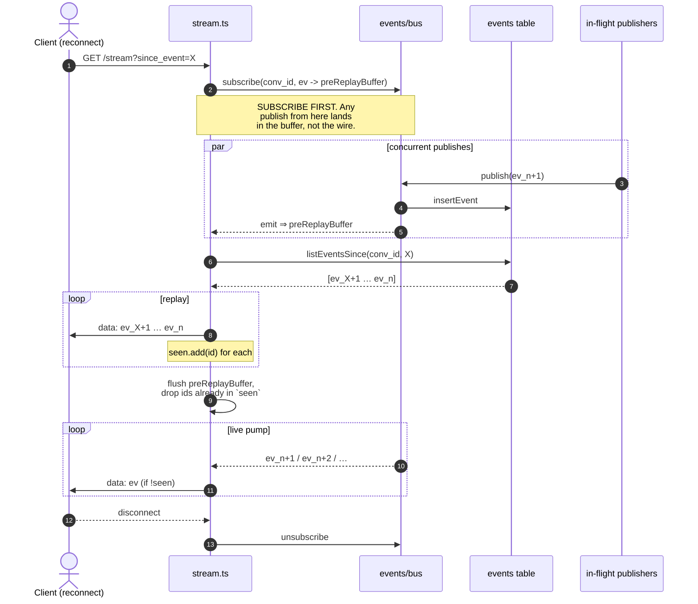
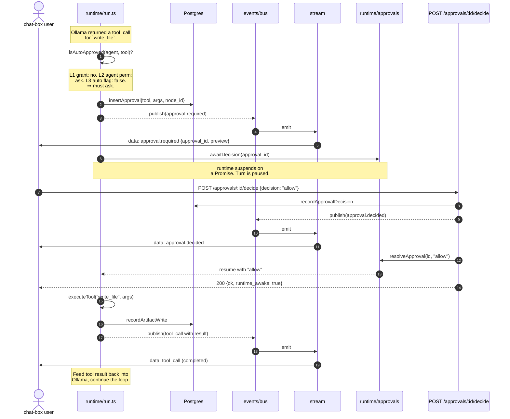
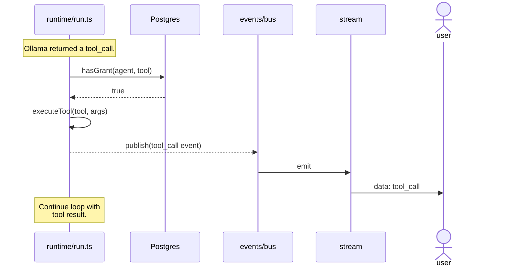
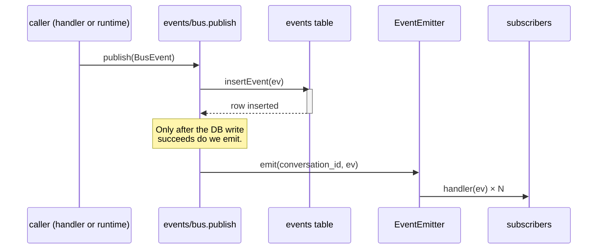
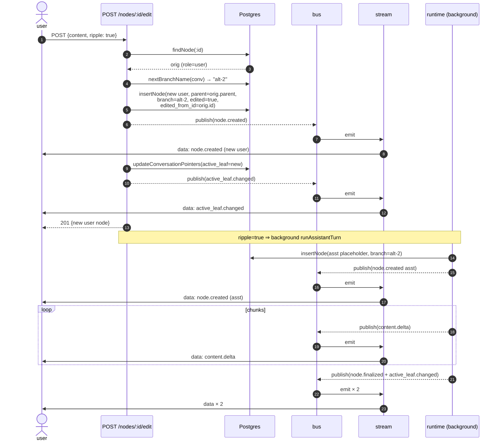
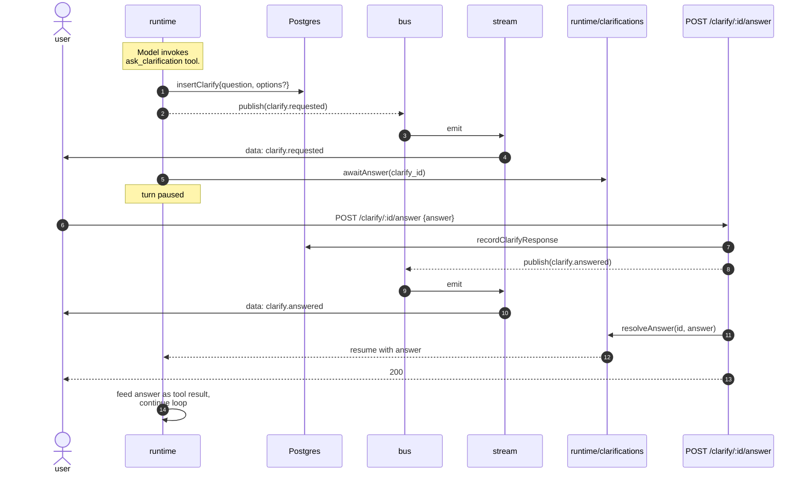
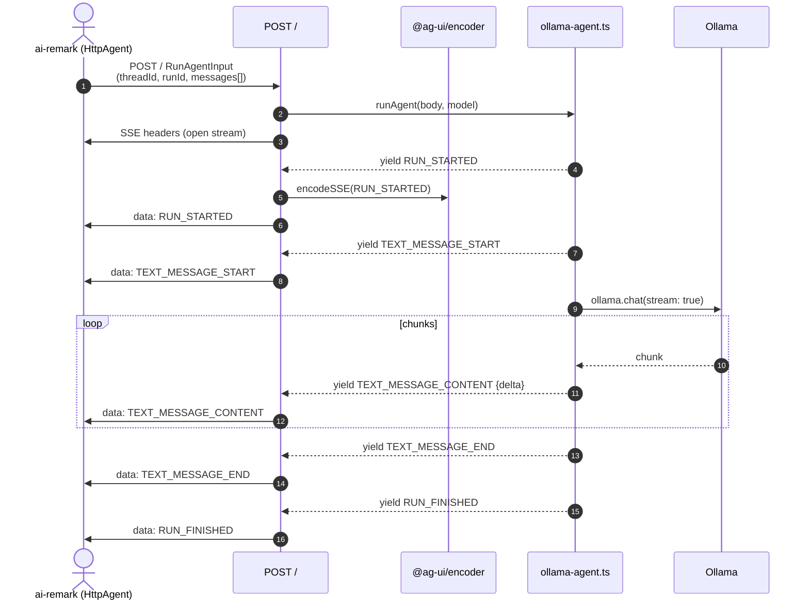
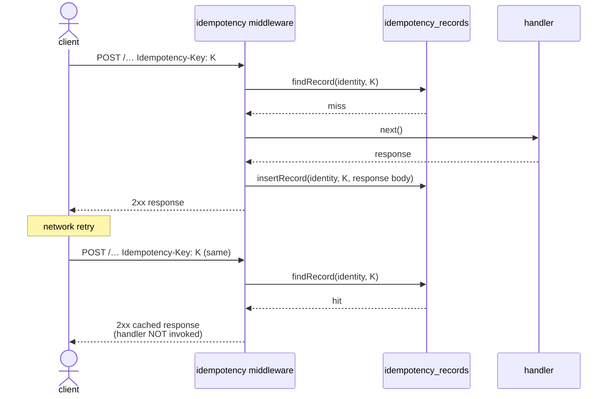

# Data flows

Sequence diagrams for the flows that matter — the ones where timing or ordering carries load-bearing invariants. Pairs with `docs/architecture.md` (structure) and `docs/user-stories.md` (motivation).

---

## 1. Send a message → stream an assistant turn (golden path)

The core loop of the product. Shows how one client POSTs while another (or the same one) reads the stream, and how the persist-then-publish pattern ties them together.

```mermaid
sequenceDiagram
    autonumber
    actor U as chat-box user
    participant MSG as POST /messages
    participant RT as runtime/run.ts
    participant BUS as events/bus
    participant DB as Postgres
    participant OL as Ollama
    participant STR as GET /stream
    actor U2 as (same user,<br/>streaming connection)

    U2->>STR: GET /stream (already open)
    STR->>BUS: subscribe(conv_id)

    U->>MSG: POST /conversations/:id/messages {content}
    MSG->>DB: getConversationRaw(id)
    DB-->>MSG: conv
    MSG->>RT: runAgent({parent, content})

    RT->>DB: insertNode(user)
    RT-->>MSG: yield node.created(user)
    MSG->>BUS: publish(node.created user)
    BUS->>DB: insertEvent
    BUS-->>STR: emit
    STR->>U2: data: node.created (user)

    MSG-->>U: 201 {user node}
    Note over MSG: return; runtime continues<br/>in background

    RT->>DB: insertNode(asst placeholder)
    RT-->>BUS: publish(node.created asst)
    BUS-->>STR: emit
    STR->>U2: data: node.created (asst)

    RT-->>BUS: publish(status.update thinking)
    BUS-->>STR: emit
    STR->>U2: data: status.update (thinking)

    RT->>OL: ollama.chat({stream: true})
    loop each chunk
        OL-->>RT: chunk
        Note over RT: ThinkSplitter feeds<br/>content vs reasoning
        RT-->>BUS: publish(content.delta)
        BUS-->>STR: emit
        STR->>U2: data: content.delta
    end

    RT->>DB: updateNode(asst, streaming=false)
    RT-->>BUS: publish(node.finalized)
    BUS-->>STR: emit
    STR->>U2: data: node.finalized

    RT->>DB: updateConversationPointers(active_leaf=asst)
    RT-->>BUS: publish(active_leaf.changed)
    BUS-->>STR: emit
    STR->>U2: data: active_leaf.changed
```

**Invariants:**

- The POST returns the user node **synchronously** (step 8) — the client can render its own message immediately. Everything after is decoupled from the POST.
- Every `publish` is persist-then-publish (see §5). The stream never hears an event that isn't already in the DB.
- If `U2` connected *after* the POST started, it would catch up via `?since_event=…` replay (see §2).

---

## 2. Reconnect with `?since_event` — race-free catch-up

The invariant that took the most work to get right. Any "simplification" that reorders steps 3 and 4 reintroduces a dropped-event window.



**Why the subscribe must come first.** If the handler replayed from the DB first and *then* subscribed, any event published during the interval between "DB read committed" and "subscription active" would be missed — it's too new for the replay query and the subscriber wasn't registered yet. Subscribing first makes that window empty.

---

## 3. Tool call with approval (user says "allow")

Hits the three-layer permission check, sends an `approval.required` event, waits for the user's decision, then resumes.



**"Always" variant.** If the user says `always`, `recordApprovalDecision` also inserts an `ApprovalGrant` row. Next time the same tool is invoked on the same agent, `isAutoApproved` returns true at L1 and the whole approval dance is skipped.

**Runtime-died variant.** If the runtime process crashed between inserting the approval and the user's decision, `resolveApproval` returns `false` (no promise to resolve) — but the `approval.decided` event is still published so the timeline records the decision. A later run that re-reads the approval sees `decision != null` and acts on it.

---

## 4. Tool call (auto-approved via grant)

Happy path with no UI involvement — the fast case.



---

## 5. Persist-then-publish (the bus invariant)

The smallest but most important flow.



If the DB write fails, `emit` never runs. The caller sees the exception; the stream sees nothing. A retry that succeeds is the only way an event reaches the wire.

---

## 6. Edit with ripple (create a branch + stream a fresh turn)

Editing a user message creates a sibling on a new `alt-N` branch. `ripple=true` then kicks off an assistant reply under the new user node.



**Key invariant:** `orig` is never mutated. The new node has `edited_from_id = orig.id`, which the client uses to show the edited-from backref. Both branches stay reachable; switching between them is just moving `active_leaf_id`.

---

## 7. Clarification

The `ask_clarification` pseudo-tool pauses the turn on a `clarify.requested` event. Symmetric to approvals.



---

## 8. AG-UI surface — `POST /` (ai-remark)

Legacy thin bridge. Stateless, no DB, no tools. Entirely separate from `/api/v1`.



**Error path:** on any Ollama failure, `ollama-agent.ts` yields `RUN_ERROR {message}` and terminates — there is no `RUN_FINISHED` after an error.

---

## 9. Idempotency replay

Second POST with the same `Idempotency-Key` returns the first response verbatim without re-running the handler.



Identity is the bearer token if set, else the client IP. Two clients can use the same key without colliding.

---

## 10. Event map — which code emits what

Minimal index; use this when tracing a wire event back to its source.

| Event `kind` | Emitted by | Context |
|---|---|---|
| `node.created` | `runtime/run.ts`, `api/nodes.ts` | New user or asst node inserted |
| `node.finalized` | `runtime/run.ts` | Asst turn complete, `streaming=false` |
| `active_leaf.changed` | `runtime/run.ts`, `api/nodes.ts` | Conversation's active leaf moved |
| `status.update` | `runtime/run.ts` | `thinking` / `streaming` / `tool_use` |
| `content.delta` | `runtime/run.ts` | Token chunk appended to asst content |
| `reasoning.delta` | `runtime/run.ts` (via `ThinkSplitter`) | Token chunk inside `<think>` |
| `approval.required` | `runtime/run.ts` | Tool needs user decision |
| `approval.decided` | `api/approvals.ts` (also runtime) | Decision recorded; runtime may still be asleep |
| `clarify.requested` | `runtime/run.ts` | `ask_clarification` tool invoked |
| `clarify.answered` | `api/clarify.ts` | User answered |
| `tool_call` | `runtime/run.ts` | Side-effectful tool executed |
| `artifact.written` | `runtime/run.ts` | `write_file` produced a new version |
| `error` | `runtime/run.ts` | Budget/deadline/conversation-missing failures |

All BusEvents share the envelope `{ id, at, conversation_id, kind, ... }` (see `src/events/types.ts`).
