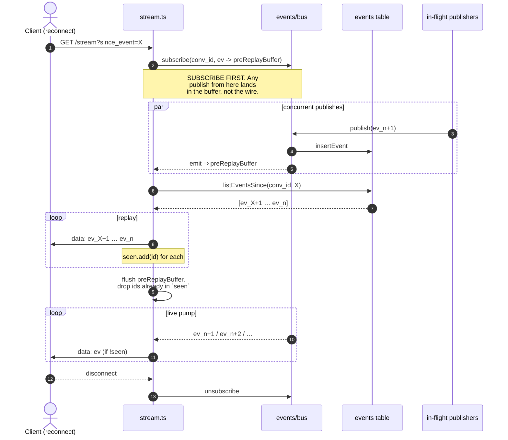
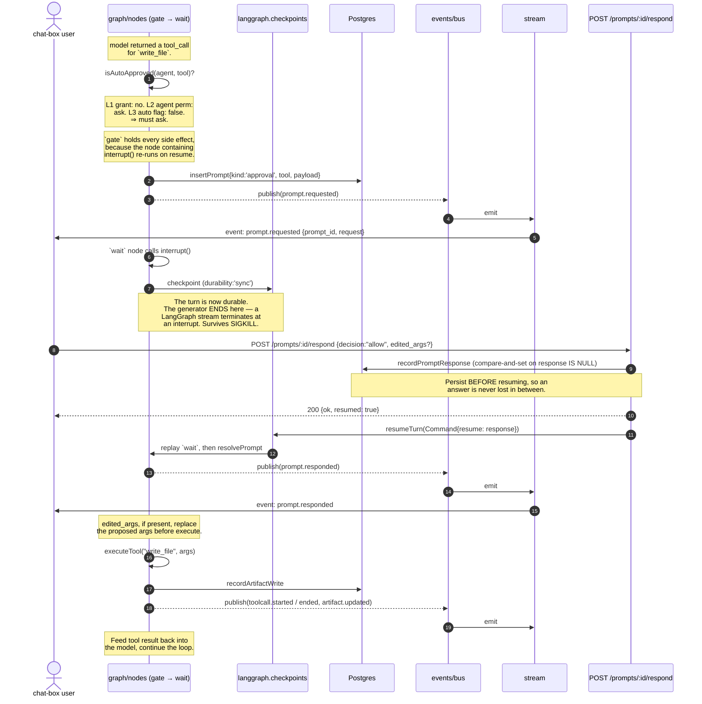
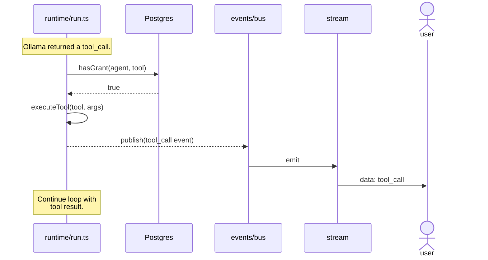
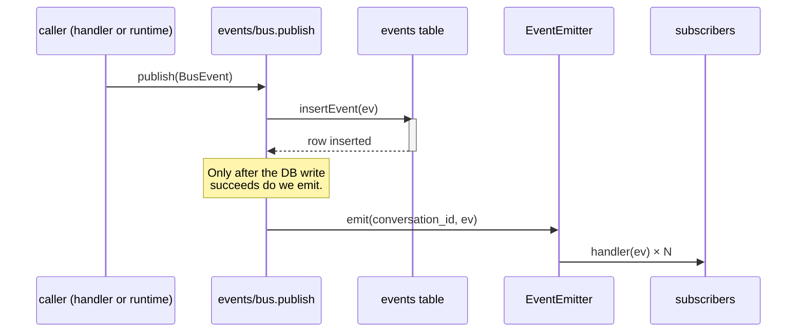
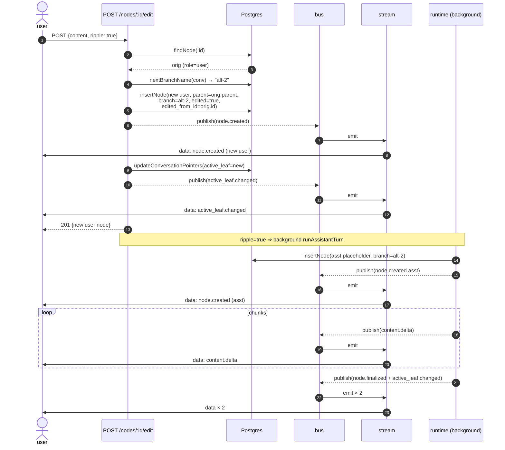
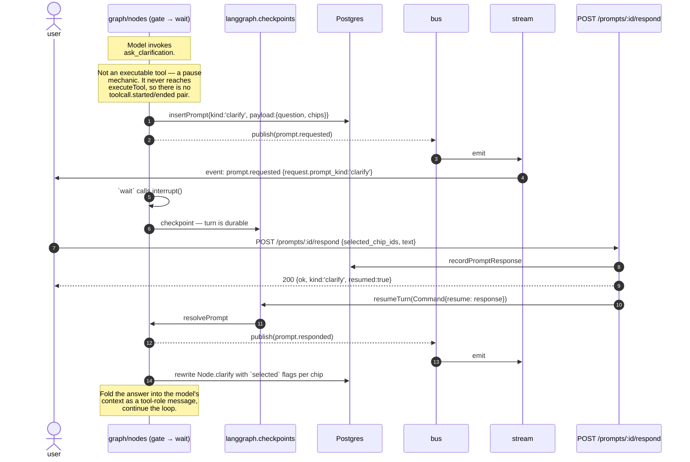
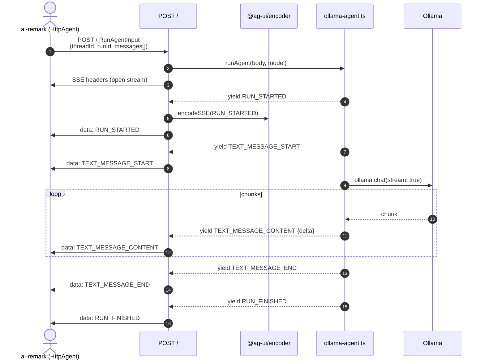
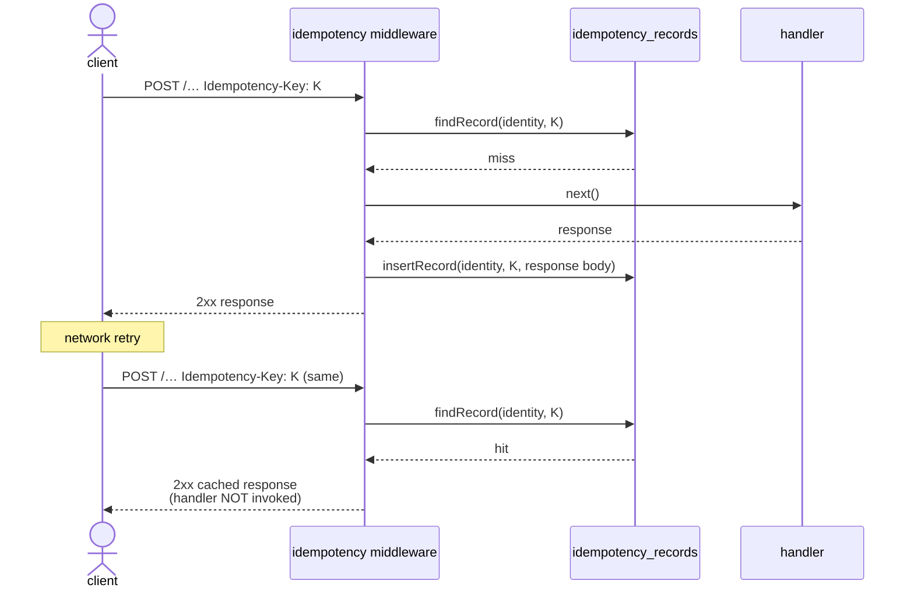
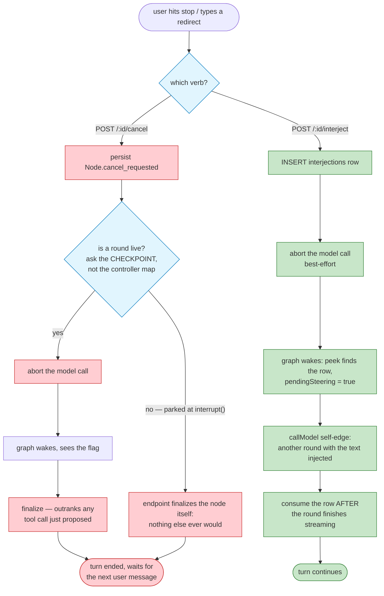

# Data flows

Sequence diagrams for the flows that matter — the ones where timing or ordering carries load-bearing invariants. Pairs with `docs/architecture.md` (structure) and `docs/user-stories.md` (motivation).

---

## 1. Send a message → stream an assistant turn (golden path)

The core loop of the product. Shows how one client POSTs while another (or the same one) reads the stream, and how the persist-then-publish pattern ties them together.

```mermaid
sequenceDiagram
    autonumber
    actor U as chat-box user
    participant MSG as POST /messages
    participant RT as runtime/run.ts
    participant BUS as events/bus
    participant DB as Postgres
    participant OL as Ollama
    participant STR as GET /stream
    actor U2 as (same user,<br/>streaming connection)

    U2->>STR: GET /stream (already open)
    STR->>BUS: subscribe(conv_id)

    U->>MSG: POST /conversations/:id/messages {content}
    MSG->>DB: getConversationRaw(id)
    DB-->>MSG: conv
    MSG->>RT: runAgent({parent, content})

    RT->>DB: insertNode(user)
    RT-->>MSG: yield node.created(user)
    MSG->>BUS: publish(node.created user)
    BUS->>DB: insertEvent
    BUS-->>STR: emit
    STR->>U2: data: node.created (user)

    MSG-->>U: 201 {user node}
    Note over MSG: return; runtime continues<br/>in background

    RT->>DB: insertNode(asst placeholder)
    RT-->>BUS: publish(node.created asst)
    BUS-->>STR: emit
    STR->>U2: data: node.created (asst)

    RT-->>BUS: publish(status.update thinking)
    BUS-->>STR: emit
    STR->>U2: data: status.update (thinking)

    RT->>OL: ollama.chat({stream: true})
    loop each chunk
        OL-->>RT: chunk
        Note over RT: ThinkSplitter feeds<br/>content vs reasoning
        RT-->>BUS: publish(content.delta)
        BUS-->>STR: emit
        STR->>U2: data: content.delta
    end

    RT->>DB: updateNode(asst, streaming=false)
    RT-->>BUS: publish(node.finalized)
    BUS-->>STR: emit
    STR->>U2: data: node.finalized

    RT->>DB: updateConversationPointers(active_leaf=asst)
    RT-->>BUS: publish(active_leaf.changed)
    BUS-->>STR: emit
    STR->>U2: data: active_leaf.changed
```

**Invariants:**

- The POST returns the user node **synchronously** (step 8) — the client can render its own message immediately. Everything after is decoupled from the POST.
- Every `publish` is persist-then-publish (see §5). The stream never hears an event that isn't already in the DB.
- If `U2` connected *after* the POST started, it would catch up via `?since_event=…` replay (see §2).

---

## 2. Reconnect with `?since_event` — race-free catch-up

The invariant that took the most work to get right. Any "simplification" that reorders steps 3 and 4 reintroduces a dropped-event window.

```mermaid
sequenceDiagram
    autonumber
    actor C as Client (reconnect)
    participant STR as stream.ts
    participant BUS as events/bus
    participant DB as events table
    participant P as in-flight publishers

    C->>STR: GET /stream?since_event=X
    STR->>BUS: subscribe(conv_id, ev -> preReplayBuffer)
    Note over STR,BUS: SUBSCRIBE FIRST. Any<br/>publish from here lands<br/>in the buffer, not the wire.

    par concurrent publishes
        P->>BUS: publish(ev_n+1)
        BUS->>DB: insertEvent
        BUS-->>STR: emit ⇒ preReplayBuffer
    end

    STR->>DB: listEventsSince(conv_id, X)
    DB-->>STR: [ev_X+1 … ev_n]
    loop replay
        STR->>C: data: ev_X+1 … ev_n
        Note over STR: seen.add(id) for each
    end

    STR->>STR: flush preReplayBuffer,<br/>drop ids already in `seen`
    loop live pump
        BUS-->>STR: ev_n+1 / ev_n+2 / …
        STR->>C: data: ev (if !seen)
    end

    C-->>STR: disconnect
    STR->>BUS: unsubscribe
```

**Why the subscribe must come first.** If the handler replayed from the DB first and *then* subscribed, any event published during the interval between "DB read committed" and "subscription active" would be missed — it's too new for the replay query and the subscriber wasn't registered yet. Subscribing first makes that window empty.

---

## 3. Tool call needing approval (user says "allow")

Hits the three-layer permission check, raises a `prompt.requested`, and **checkpoints the turn to Postgres**. The graph stream ends here — the continuation is a separate resume from whichever request carries the answer.

```mermaid
sequenceDiagram
    autonumber
    actor U as chat-box user
    participant G as graph/nodes (gate → wait)
    participant CP as langgraph.checkpoints
    participant DB as Postgres
    participant BUS as events/bus
    participant STR as stream
    participant API as POST /prompts/:id/respond

    Note over G: model returned a tool_call<br/>for `write_file`.
    G->>G: isAutoApproved(agent, tool)?
    Note over G: L1 grant: no. L2 agent perm:<br/>ask. L3 auto flag: false.<br/>⇒ must ask.

    Note over G: `gate` holds every side effect,<br/>because the node containing<br/>interrupt() re-runs on resume.
    G->>DB: insertPrompt{kind:'approval', tool, payload}
    G-->>BUS: publish(prompt.requested)
    BUS->>STR: emit
    STR->>U: event: prompt.requested {prompt_id, request}

    G->>G: `wait` node calls interrupt()
    G->>CP: checkpoint (durability:'sync')
    Note over G,CP: The turn is now durable.<br/>The generator ENDS here — a<br/>LangGraph stream terminates at<br/>an interrupt. Survives SIGKILL.

    U->>API: POST /prompts/:id/respond {decision:"allow", edited_args?}
    API->>DB: recordPromptResponse (compare-and-set on response IS NULL)
    Note over API,DB: Persist BEFORE resuming, so an<br/>answer is never lost in between.
    API-->>U: 200 {ok, resumed: true}
    API->>CP: resumeTurn(Command{resume: response})

    CP->>G: replay `wait`, then resolvePrompt
    G-->>BUS: publish(prompt.responded)
    BUS->>STR: emit
    STR->>U: event: prompt.responded
    Note over G: edited_args, if present, replace<br/>the proposed args before execute.
    G->>G: executeTool("write_file", args)
    G->>DB: recordArtifactWrite
    G-->>BUS: publish(toolcall.started / ended, artifact.updated)
    BUS->>STR: emit

    Note over G: Feed tool result back into<br/>the model, continue the loop.
```

**"Always" variant.** The endpoint inserts an `ApprovalGrant`, and so does `resolvePrompt` — the upsert makes the double-write a no-op. Next time the same tool is invoked on the same agent, `isAutoApproved` returns true at L1 and the whole round-trip is skipped.

**Server-restarted variant.** This is the case the graph exists for. The checkpoint outlives the process, so on boot `runtime/recovery.ts` sees a pending interrupt and leaves the turn alone; the next `POST /prompts/:id/respond` resumes it normally. Verified end-to-end across a `SIGKILL`.

**Nothing-to-resume variant.** If no interrupt is pending (turn already finished, or a checkpoint predating the graph), the endpoint returns `resumed: false` and publishes `prompt.responded` itself so the timeline still records the answer. Not an error.

**Concurrent-response variant.** Two simultaneous responses hit the compare-and-set; exactly one claims the row and resumes, the other gets `409` carrying the winning response.

---

## 4. Tool call (auto-approved via grant)

Happy path with no UI involvement — the fast case.

```mermaid
sequenceDiagram
    participant RT as runtime/run.ts
    participant DB as Postgres
    participant BUS as events/bus
    participant STR as stream
    actor U as user

    Note over RT: Ollama returned a tool_call.
    RT->>DB: hasGrant(agent, tool)
    DB-->>RT: true
    RT->>RT: executeTool(tool, args)
    RT-->>BUS: publish(tool_call event)
    BUS->>STR: emit
    STR->>U: data: tool_call
    Note over RT: Continue loop with<br/>tool result.
```

---

## 5. Persist-then-publish (the bus invariant)

The smallest but most important flow.

```mermaid
sequenceDiagram
    participant C as caller (handler or runtime)
    participant BUS as events/bus.publish
    participant DB as events table
    participant EE as EventEmitter
    participant SUB as subscribers

    C->>BUS: publish(BusEvent)
    BUS->>DB: insertEvent(ev)
    activate DB
    DB-->>BUS: row inserted
    deactivate DB
    Note over BUS: Only after the DB write<br/>succeeds do we emit.
    BUS->>EE: emit(conversation_id, ev)
    EE->>SUB: handler(ev) × N
```

If the DB write fails, `emit` never runs. The caller sees the exception; the stream sees nothing. A retry that succeeds is the only way an event reaches the wire.

---

## 6. Edit with ripple (create a branch + stream a fresh turn)

Editing a user message creates a sibling on a new `alt-N` branch. `ripple=true` then kicks off an assistant reply under the new user node.

```mermaid
sequenceDiagram
    autonumber
    actor U as user
    participant EDIT as POST /nodes/:id/edit
    participant DB as Postgres
    participant BUS as bus
    participant STR as stream
    participant RT as runtime (background)

    U->>EDIT: POST {content, ripple: true}
    EDIT->>DB: findNode(:id)
    DB-->>EDIT: orig (role=user)
    EDIT->>DB: nextBranchName(conv) → "alt-2"
    EDIT->>DB: insertNode(new user, parent=orig.parent,<br/>branch=alt-2, edited=true,<br/>edited_from_id=orig.id)
    EDIT-->>BUS: publish(node.created)
    BUS->>STR: emit
    STR->>U: data: node.created (new user)
    EDIT->>DB: updateConversationPointers(active_leaf=new)
    EDIT-->>BUS: publish(active_leaf.changed)
    BUS->>STR: emit
    STR->>U: data: active_leaf.changed
    EDIT-->>U: 201 {new user node}

    Note over EDIT,RT: ripple=true ⇒ background runAssistantTurn

    RT->>DB: insertNode(asst placeholder, branch=alt-2)
    RT-->>BUS: publish(node.created asst)
    BUS->>STR: emit
    STR->>U: data: node.created (asst)

    loop chunks
        RT-->>BUS: publish(content.delta)
        BUS->>STR: emit
        STR->>U: data: content.delta
    end

    RT-->>BUS: publish(node.finalized + active_leaf.changed)
    BUS->>STR: emit × 2
    STR->>U: data × 2
```

**Key invariant:** `orig` is never mutated. The new node has `edited_from_id = orig.id`, which the client uses to show the edited-from backref. Both branches stay reachable; switching between them is just moving `active_leaf_id`.

---

## 7. Clarification

The `ask_clarification` pseudo-tool pauses the turn the same way an approval does — **the same nodes, the same table, the same endpoint**, differing only in `prompt_kind`. That symmetry is why the two collapsed into one prompt model.

```mermaid
sequenceDiagram
    autonumber
    actor U as user
    participant G as graph/nodes (gate → wait)
    participant CP as langgraph.checkpoints
    participant DB as Postgres
    participant BUS as bus
    participant STR as stream
    participant API as POST /prompts/:id/respond

    Note over G: Model invokes<br/>ask_clarification.
    Note over G: Not an executable tool — a pause<br/>mechanic. It never reaches<br/>executeTool, so there is no<br/>toolcall.started/ended pair.
    G->>DB: insertPrompt{kind:'clarify', payload:{question, chips}}
    G-->>BUS: publish(prompt.requested)
    BUS->>STR: emit
    STR->>U: event: prompt.requested {request.prompt_kind:'clarify'}
    G->>G: `wait` calls interrupt()
    G->>CP: checkpoint — turn is durable

    U->>API: POST /prompts/:id/respond {selected_chip_ids, text}
    API->>DB: recordPromptResponse
    API-->>U: 200 {ok, kind:'clarify', resumed:true}
    API->>CP: resumeTurn(Command{resume: response})

    CP->>G: resolvePrompt
    G-->>BUS: publish(prompt.responded)
    BUS->>STR: emit
    G->>DB: rewrite Node.clarify with `selected` flags per chip
    Note over G: Fold the answer into the model's<br/>context as a tool-role message,<br/>continue the loop.
```

Note the asymmetry worth knowing: `Node.clarify` *is* written, but only **after** the answer. `Node.approval` is never written at all. Neither tells a client that a prompt is currently open — that is what `GET /conversations/:id/prompts?pending=true` is for.

---

## 8. AG-UI surface — `POST /` (ai-remark)

Legacy thin bridge. Stateless, no DB, no tools. Entirely separate from `/api/v1`.

```mermaid
sequenceDiagram
    autonumber
    actor AR as ai-remark (HttpAgent)
    participant H as POST /
    participant ENC as @ag-ui/encoder
    participant OLA as ollama-agent.ts
    participant OL as Ollama

    AR->>H: POST / RunAgentInput<br/>(threadId, runId, messages[])
    H->>OLA: runAgent(body, model)
    H->>AR: SSE headers (open stream)
    OLA-->>H: yield RUN_STARTED
    H->>ENC: encodeSSE(RUN_STARTED)
    H->>AR: data: RUN_STARTED
    OLA-->>H: yield TEXT_MESSAGE_START
    H->>AR: data: TEXT_MESSAGE_START

    OLA->>OL: ollama.chat(stream: true)
    loop chunks
        OL-->>OLA: chunk
        OLA-->>H: yield TEXT_MESSAGE_CONTENT {delta}
        H->>AR: data: TEXT_MESSAGE_CONTENT
    end

    OLA-->>H: yield TEXT_MESSAGE_END
    H->>AR: data: TEXT_MESSAGE_END
    OLA-->>H: yield RUN_FINISHED
    H->>AR: data: RUN_FINISHED
```

**Error path:** on any Ollama failure, `ollama-agent.ts` yields `RUN_ERROR {message}` and terminates — there is no `RUN_FINISHED` after an error.

---

## 9. Idempotency replay

Second POST with the same `Idempotency-Key` returns the first response verbatim without re-running the handler.

```mermaid
sequenceDiagram
    actor C as client
    participant IM as idempotency middleware
    participant DB as idempotency_records
    participant H as handler

    C->>IM: POST /… Idempotency-Key: K
    IM->>DB: findRecord(identity, K)
    DB-->>IM: miss
    IM->>H: next()
    H-->>IM: response
    IM->>DB: insertRecord(identity, K, response body)
    IM-->>C: 2xx response

    Note over C: network retry

    C->>IM: POST /… Idempotency-Key: K (same)
    IM->>DB: findRecord(identity, K)
    DB-->>IM: hit
    IM-->>C: 2xx cached response<br/>(handler NOT invoked)
```

Identity is the bearer token if set, else the client IP. Two clients can use the same key without colliding.

---

## 10. Event map — which code emits what

Minimal index; use this when tracing a wire event back to its source.

All 16 kinds, checked against the code. Note almost everything now comes from `graph/nodes.ts` — `runtime/run.ts` is only a façade and emits just the two user-node events before delegating.

| Event `kind` | Emitted by | Context |
|---|---|---|
| `node.created` | `graph/nodes.ts#prepare` (asst), `runtime/run.ts` (user), `api/nodes.ts` | New node inserted |
| `node.finalized` | `graph/nodes.ts#finalize` | Asst turn complete, `streaming=false` |
| `active_leaf.changed` | `graph/nodes.ts#finalize`, `runtime/run.ts`, `api/nodes.ts` | Active leaf moved |
| `status.update` | `graph/nodes.ts` | `thinking` / `streaming` / `tool` / `approval` |
| `content.delta` | `graph/nodes.ts#callModel` | Token chunk appended to asst content |
| `reasoning.delta` | `graph/nodes.ts#callModel` (via `ThinkSplitter`) | Token chunk inside `<think>` |
| `reasoning.step.end` | `graph/nodes.ts#callModel` | One per closed `</think>` |
| `toolcall.proposed` | `graph/nodes.ts#gate` | Model asked for a tool, before any gating |
| `toolcall.started` | `graph/nodes.ts#execute` | Args here are `edited_args` if the user edited |
| `toolcall.ended` | `graph/nodes.ts#execute`, `#resolvePrompt` (on deny) | Result or error |
| `prompt.requested` | `graph/nodes.ts#gate` | A human is needed: approval or clarify |
| `prompt.responded` | `graph/nodes.ts#resolvePrompt`; `api/prompts.ts` only when there is nothing to resume | Answer applied |
| `interjection.received` | `api/interject.ts` | User steered a running turn; `aborted` says whether a live call was cut |
| `turn.cancelled` | `api/cancel.ts`, `runtime/recovery.ts` | User stopped the turn; always before the finalize |
| `artifact.updated` | `graph/nodes.ts#execute` | `write_file` produced a new version |
| `error` | `graph/nodes.ts`, `runtime/recovery.ts` | Budget/deadline/missing-conversation, or an unrecoverable turn found at boot |

### 10b. Interrupting a running turn — cancel vs. interject

Same abort plumbing, opposite effect on the turn. Both persist their intent
before touching the in-flight call, because the endpoint's 200 is a promise to
the user that the input landed.

```mermaid
flowchart TB
    U([user hits stop / types a redirect]) --> WHICH{which verb?}

    WHICH -->|"POST /:id/cancel"| C1[persist Node.cancel_requested]
    C1 --> C2{is a round live?<br/>ask the CHECKPOINT,<br/>not the controller map}
    C2 -->|yes| C3[abort the model call] --> C4[graph wakes, sees the flag]
    C4 --> C5[finalize — outranks any<br/>tool call just proposed]
    C2 -->|"no — parked at interrupt()"| C6[endpoint finalizes the node itself:<br/>nothing else ever would]
    C5 --> DONE([turn ended, waits for<br/>the next user message])
    C6 --> DONE

    WHICH -->|"POST /:id/interject"| I1[INSERT interjections row]
    I1 --> I2[abort the model call<br/>best-effort]
    I2 --> I3[graph wakes: peek finds the row,<br/>pendingSteering = true]
    I3 --> I4[callModel self-edge:<br/>another round with the text injected]
    I4 --> I5[consume the row AFTER<br/>the round finishes streaming]
    I5 --> CONT([turn continues])

    classDef stop fill:#ffcdd2,stroke:#c62828
    classDef steer fill:#c8e6c9,stroke:#2e7d32
    classDef decision fill:#e1f5fe,stroke:#0277bd
    class C1,C3,C5,C6,DONE stop
    class I1,I2,I3,I4,I5,CONT steer
    class WHICH,C2 decision
```

**Why cancellation is durable.** Boot recovery replays unfinished turns, so an
in-memory flag would let a restart resurrect a turn the user had stopped. It
also makes a prompt response that arrives *after* the stop return
`cancelled: true` instead of resuming — the user hitting stop while an approval
card is on screen, then clicking Allow.

**Why steering is durable, and consumed late.** The row exists before the 200,
so a restart cannot silently discard what the user typed. `callModel` peeks
before the round and consumes only after it finishes streaming, making delivery
at-least-once: a crash mid-round re-injects rather than swallowing the input.
Re-steering is harmless; losing steering is not.

**Two failure modes this shape was built to fix**, both found against a live
Ollama rather than in tests:

- An aborted round produces no tool calls, which is indistinguishable from a
  finished one — so the loop finalized and the steering was never applied
  (`consumed_at` stayed null). Hence `pendingSteering` and the self-edge.
- A stale `AbortController` left over from the previous round made `cancel`
  report `aborted: true` for a *parked* turn, which skipped the branch that
  finalizes a parked node and stranded it as `streaming` forever. Hence
  deriving "is a round live?" from the checkpoint, and clearing the controller
  when a round ends.

---

All BusEvents share the envelope `{ id, at, conversation_id, kind, ... }` (see `src/events/types.ts`), and every one is persisted by `events/bus.ts#publish` **before** being emitted to live subscribers.
