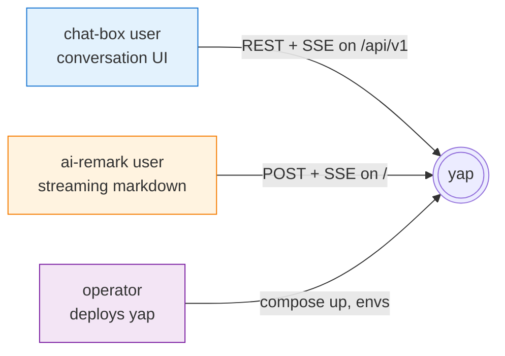

# User stories

Written from the perspective of the three kinds of caller that use yap. Each story maps to the endpoints / events / code paths that deliver it.

Legend:

- **As …** — who the story is for (a persona, not a human)
- **So that …** — the outcome
- **Wire surface** — the endpoints and events the story exercises
- **Server path** — the routers / runtime files that implement it

---

## Personas

- **chat-box user** drives a full chat product — trees, approvals, artifacts, tags, exports, share links.
- **ai-remark user** (or any AG-UI client) streams a single assistant turn end-to-end with no persistence.
- **operator** runs yap locally or in compose and is responsible for auth, rate limits, and the Ollama model.

---

## P1 — chat-box user

### 1.1 Start a conversation

**As** a chat-box user **I want** to create a conversation attached to a specific agent **so that** my messages are routed through that agent's system prompt and model.

- Wire surface: `POST /api/v1/conversations` → returns `{ id, agent_id, active_leaf_id: null, ... }`
- Server path: `api/conversations.ts` → `db/queries.ts#insertConversation`
- Notes: conversation starts empty (`root_node_id=null`); the first `POST /messages` creates the root user node.

### 1.2 Send a message and watch it stream

**As** a chat-box user **I want** to see the assistant's reply token-by-token with a "thinking" indicator **so that** the UI feels responsive.

- Wire surface:
  - Open `GET /api/v1/conversations/:id/stream` (SSE)
  - `POST /api/v1/conversations/:id/messages` with `{ content }`
  - Returns the user node synchronously; assistant events follow on the stream:
    `node.created` (asst) → `status.update: thinking` → `content.delta × N` → `status.update: streaming` → `node.finalized` → `active_leaf.changed`
- Server path: `api/messages.ts` → `runtime/run.ts#runAgent`
- Why it's structured this way: the stream is persist-then-publish (see `docs/architecture.md` §4), so the client sees the same events whether it was connected before the POST, after, or reconnects mid-stream via `?since_event=<id>`.

### 1.3 See the assistant's reasoning trace

**As** a chat-box user running a reasoning model (`deepseek-r1`, `qwq`) **I want** `<think>…</think>` segments separated from the final content **so that** I can show a collapsible "thinking" section.

- Wire surface: `reasoning.delta` events interleaved with `content.delta` during a turn
- Server path: `runtime/think-splitter.ts` (streaming state machine) inside `runtime/run.ts`
- Notes: the splitter handles partial tags across chunk boundaries; default model `qwen2.5:14b` emits no `<think>` tags so this path is inert unless you switch models.

### 1.4 Approve or deny a tool call

**As** a chat-box user **I want** the assistant to ask before running `write_file` **so that** I never silently write files.

- Wire surface:
  - Incoming: `approval.required` event carries `{ approval_id, tool, preview }`
  - Outgoing: `POST /api/v1/approvals/:id/decide` with `{ decision: "allow" | "always" | "deny" }`
  - Follow-up: `approval.decided` event then the tool result events
- Server path: `api/approvals.ts` + `runtime/run.ts#isAutoApproved` + `runtime/approvals.ts#awaitDecision/resolveApproval`
- Permission layers (see `docs/architecture.md` §8): session grant → agent `permission_default` → `TOOL_DEFS.auto` flag.

### 1.5 "Allow always" for a tool

**As** a chat-box user **I want** to stop being asked about `web_search` in this conversation **so that** I only approve once.

- Wire surface: `POST /api/v1/approvals/:id/decide` with `{ decision: "always" }` → creates an `ApprovalGrant`
- Settings: `GET /api/v1/approvals/grants` (list), `DELETE /api/v1/approvals/grants/:key` (revoke)
- Server path: `api/approvals.ts` — belt-and-braces: both the approvals handler and the runtime write the grant (upsert makes double-write safe).

### 1.6 Answer a clarifying question

**As** a chat-box user **I want** the agent to pause and ask when a request is ambiguous **so that** it doesn't guess and waste a turn.

- Wire surface:
  - Incoming: `clarify.requested` event carries `{ clarify_id, question, options? }`
  - Outgoing: `POST /api/v1/clarify/:id/answer` with `{ answer }`
  - Follow-up: `clarify.answered` event, then the turn resumes
- Server path: `api/clarify.ts` + `runtime/clarifications.ts#awaitAnswer` — triggered by the `ask_clarification` pseudo-tool the agent can call.

### 1.7 Edit a past message

**As** a chat-box user **I want** to revise a question I sent three turns ago **so that** I can explore a different direction without losing the original.

- Wire surface:
  - `GET /api/v1/nodes/:id/ripple-preview` → `{ descendants, tool_calls, new_approvals }`
  - `POST /api/v1/nodes/:id/edit` with `{ content, ripple?: true }`
  - Creates a sibling user node on `alt-N` branch (`edited=true`, `edited_from_id` backref). With `ripple=true`, also streams a fresh assistant turn.
- Server path: `api/nodes.ts#edit`
- Why siblings: original is never mutated — the tree model (see `docs/architecture.md` §7) keeps both branches reachable.

### 1.8 Regenerate an assistant reply

**As** a chat-box user **I want** to get a different assistant answer to the same question **so that** I can compare options.

- Wire surface: `POST /api/v1/nodes/:id/regenerate` → returns the new placeholder asst node synchronously, streams the rest
- Server path: `api/nodes.ts#regenerate` → `runtime/run.ts#runAssistantTurn`

### 1.9 Branch mid-conversation

**As** a chat-box user **I want** to start a fresh turn from an earlier point **so that** I can ask a different follow-up without losing the current thread.

- Wire surface: `POST /api/v1/nodes/:id/branch` → creates an empty user node on `alt-N`, moves `active_leaf` to it, no generation
- Server path: `api/nodes.ts#branch`

### 1.10 Prune a dead subtree

**As** a chat-box user **I want** to delete an abandoned branch **so that** my tree view stays clean.

- Wire surface: `DELETE /api/v1/nodes/:id?subtree=true[&fallback_leaf=<id>]`
- Server path: `api/nodes.ts` (delete handler)
- Safety: if `active_leaf` was inside the subtree, `fallback_leaf` is required or the server returns 409.

### 1.11 Pin snippets and take notes

**As** a chat-box user **I want** to pin useful excerpts and attach a note to the whole thread **so that** I can revisit context quickly.

- Wire surface:
  - `PUT /api/v1/conversations/:id/note` / `GET` / `DELETE`
  - `POST /api/v1/conversations/:id/pinned` / `GET` / `DELETE /pinned/:pid`
- Server path: `api/notes.ts`

### 1.12 Tag and filter conversations

**As** a chat-box user with many conversations **I want** to tag them **so that** I can filter by topic.

- Wire surface:
  - `POST /api/v1/tags`, `GET /api/v1/tags`, `PATCH/DELETE /api/v1/tags/:id`
  - `POST /api/v1/conversations/:id/tags` / `DELETE /tags/:tagId`
- Server path: `api/tags.ts` + `api/conversations.ts`

### 1.13 Search conversations and messages

**As** a chat-box user **I want** to grep across everything I've said or the assistant has said **so that** I can find a past answer.

- Wire surface: `GET /api/v1/search?q=…` → highlighted matches across conversations, messages, agents
- Server path: `api/search.ts` — ILIKE-based; not full-text-indexed yet.

### 1.14 See a timeline of significant events

**As** a chat-box user **I want** a compact activity feed for a conversation **so that** I can scan what happened without reading every turn.

- Wire surface: `GET /api/v1/conversations/:id/timeline` → synthesised `TimelineEvent[]`
- Server path: `api/timeline.ts` — projects over the `events` table.

### 1.15 Export a conversation

**As** a chat-box user **I want** to download a conversation as markdown or JSON **so that** I can archive or share it offline.

- Wire surface: `GET /api/v1/conversations/:id/export?format=md|json`
- Server path: `api/export-share.ts`

### 1.16 Share a read-only link

**As** a chat-box user **I want** to generate a URL anyone can read without an account **so that** I can show off a transcript.

- Wire surface:
  - `POST /api/v1/conversations/:id/share` → `{ token }`
  - `GET /api/v1/shared/:token` (public; skips bearer auth)
  - `DELETE /api/v1/shares/:token`
- Server path: `api/export-share.ts` — `/shared/:token` is the one route deliberately exempt from `bearerAuth`.

### 1.17 Open and diff artifacts (canvas)

**As** a chat-box user **I want** to see what the agent wrote to disk, with diffs between versions **so that** I can review changes before committing.

- Wire surface:
  - `GET /api/v1/artifacts/:id/preview`
  - `GET /api/v1/artifacts/:id/versions`
  - `GET /api/v1/artifacts/:id/diff?from=…&to=…`
- Server path: `api/artifacts.ts` — reads from the `ARTIFACTS_DIR` sandbox; every write produces an `ArtifactVersion`.

### 1.18 Swap agents and inspect versions

**As** a chat-box user curating agents **I want** to edit an agent's prompt, see version history, diff, and roll back **so that** I can iterate without losing a known-good prompt.

- Wire surface:
  - `POST /api/v1/agents` / `PATCH /:id` / `GET /:id/versions` / `POST /:id/restore/:version`
  - `GET /:id/diff?from=…&to=…`
  - `GET /api/v1/agent-templates` / `POST /api/v1/agent-templates/:id/from`
- Server path: `api/agents.ts` + `api/agent-templates.ts`

### 1.19 Reconnect without losing events

**As** a chat-box user on flaky wifi **I want** to reconnect to the stream and catch up on anything I missed **so that** no events are lost.

- Wire surface: `GET /api/v1/conversations/:id/stream?since_event=<last-event-id>` → replays events with id > cursor, then resumes live
- Server path: `api/stream.ts` (subscribe-first pattern, see `docs/architecture.md` §5)

### 1.20 Replay an accidental duplicate POST

**As** a chat-box developer writing client retry logic **I want** my `Idempotency-Key` header to return the cached response on retry **so that** retries don't double-send messages.

- Wire surface: any mutating request with `Idempotency-Key: <uuid>`; second request returns the first response body
- Server path: `api/middleware/idempotency.ts` — records in `idempotency_records` table keyed by identity + key.

---

## P2 — ai-remark user (AG-UI)

### 2.1 Stream a single assistant turn

**As** an ai-remark user **I want** to POST an AG-UI `RunAgentInput` and get `TEXT_MESSAGE_CONTENT` deltas **so that** the canvas renders markdown as it arrives.

- Wire surface: `POST /` with AG-UI body → SSE with `RUN_STARTED → TEXT_MESSAGE_START → TEXT_MESSAGE_CONTENT × N → TEXT_MESSAGE_END → RUN_FINISHED`
- Server path: `ollama-agent.ts` (the legacy bridge)
- Contract details: `INTEGRATION.md`

### 2.2 Override the model per request

**As** an ai-remark user experimenting with models **I want** to pick the model without restarting yap **so that** I can compare `qwen2.5` vs `llama3.1` on the fly.

- Wire surface: put `"model"` at the root of the body (raw fetch) or in `forwardedProps.model` (`@ag-ui/client`)
- Precedence: root `model` > `forwardedProps.model` > env `MODEL` > default `qwen2.5:14b`
- Server path: `server.ts` `app.post('/')` + `ollama-agent.ts`

### 2.3 Cancel an in-flight run

**As** an ai-remark user **I want** to cancel a long generation mid-stream **so that** I can stop runaway output.

- Wire surface: abort the `fetch`; server ends the Ollama stream
- Server path: AG-UI client's `HttpAgent.abortRun()` propagates via `AbortController`.

### 2.4 Handle server-side errors

**As** an ai-remark user **I want** a typed error event when Ollama can't serve the request **so that** I can surface "model not found" to the user.

- Wire surface: `RUN_ERROR { message }` replaces `RUN_FINISHED`; stream closes after
- Server path: `ollama-agent.ts` error arm

---

## P3 — operator

### 3.1 Bring the whole stack up in one command

**As** an operator trying yap for the first time **I want** `docker compose up --build` to give me a working server with Postgres, Ollama, a pulled model, and a migrated schema **so that** I can evaluate it without manual steps.

- Wire surface: `docker-compose.yml` with `postgres`, `ollama`, `model-init`, `db-init`, `yap`
- Server path: `Dockerfile` + compose; `model-init` and `db-init` are one-shots gating `yap` startup.

### 3.2 Protect the API with a bearer token

**As** an operator exposing yap beyond localhost **I want** to require a bearer token **so that** no one else on the network can use it.

- Wire surface: set `YAP_API_TOKEN=…`; `/api/v1/*` now requires `Authorization: Bearer …`; `/shared/:token` stays public
- Server path: `api/middleware/auth.ts`

### 3.3 Rate-limit noisy clients

**As** an operator **I want** to cap requests per minute per identity **so that** one runaway client doesn't starve everyone.

- Wire surface: `RATE_LIMIT_RPM=60` (default); sliding window per bearer token (or per IP in open mode); returns 429 on overflow
- Server path: `api/middleware/rate-limit.ts`

### 3.4 Cap runaway tool loops

**As** an operator **I want** a hard ceiling on model⇄tool rounds per turn **so that** a pathological agent can't spin forever.

- Wire surface: `MAX_TOOL_ROUNDS=8` (default); on exceeding, the runtime yields an `error` event and stops the turn
- Server path: `runtime/run.ts` round counter

### 3.5 Kill a slow Ollama call

**As** an operator **I want** per-round Ollama calls to time out **so that** a stuck model doesn't hang the stream.

- Wire surface: `TOOL_DEADLINE_MS=30000` (default) per round; `AbortController` cancels the Ollama stream
- Server path: `runtime/run.ts` — `AbortController` per round

### 3.6 Sandbox the filesystem

**As** an operator worried about `write_file` escapes **I want** writes confined to a known directory **so that** a compromised prompt can't trash the system.

- Wire surface: `ARTIFACTS_DIR` env var (default `../artifacts`); path-traversal attempts are rejected
- Server path: `registry/tools.ts` (`executeTool` for `write_file`) + unit test in `test/unit/tools.test.ts`

### 3.7 Monitor with a health probe

**As** an operator running yap under a process supervisor **I want** a cheap liveness check **so that** I know when to restart.

- Wire surface: `GET /health` → `{ ok: true, model, ollamaHost }`
- Server path: `server.ts`

### 3.8 Seed fixtures for demos

**As** an operator showing the product off **I want** a one-call seed that loads sample data **so that** I don't have to manually create conversations.

- Wire surface: `POST /api/v1/dev/seed` → loads SAMPLE_* fixtures (7 agents, 9 conversations, 9 nodes)
- Server path: `api/dev.ts` + `seed/samples.ts`

---

## Story → code cross-reference

| Story | Endpoint(s) | Server file(s) | Events emitted |
|---|---|---|---|
| 1.2 | `POST /conversations/:id/messages` + `GET /stream` | `api/messages.ts`, `api/stream.ts`, `runtime/run.ts` | `node.created`, `status.update`, `content.delta`, `node.finalized`, `active_leaf.changed` |
| 1.3 | `GET /stream` | `runtime/think-splitter.ts` | `reasoning.delta` |
| 1.4 | `POST /approvals/:id/decide` | `api/approvals.ts`, `runtime/approvals.ts` | `approval.required`, `approval.decided` |
| 1.6 | `POST /clarify/:id/answer` | `api/clarify.ts`, `runtime/clarifications.ts` | `clarify.requested`, `clarify.answered` |
| 1.7 | `POST /nodes/:id/edit` | `api/nodes.ts` | `node.created`, `active_leaf.changed`, optional turn events |
| 1.19 | `GET /stream?since_event=…` | `api/stream.ts` | all persisted events since cursor |
| 2.1 | `POST /` | `ollama-agent.ts`, `server.ts` | AG-UI `TEXT_MESSAGE_*`, `RUN_*` |
| 3.2 | any `/api/v1/*` | `api/middleware/auth.ts` | — |
| 3.3 | any `/api/v1/*` | `api/middleware/rate-limit.ts` | — |
